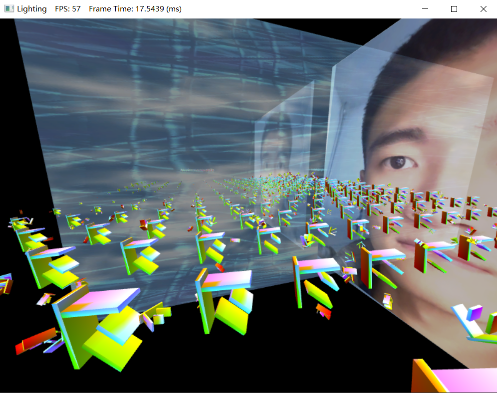

# graphics_basic_DX11
## 实现基本内容

1. 相机在场景内漫游：

   实现用‘W’, ‘S’, ‘A’, ‘D’键前后左右平移相机；

   鼠标滑动调整飞行方向(左右和仰俯);

   鼠标只能调整相机在X轴（仰俯）和Y轴（左右）的转角，为了实现飞行的桶形滚转，需要同时调整相机绕Z轴的转角，加入‘Q’和‘E’键的控制，用于实现飞行中的桶形滚转；

2. 基于Direct3D 11渲染管线，在同一场景中，使用纹理映射实现贴图动画；用HLSL编写shader实现动态的聚光灯、点光源等Blinn-Phong光照模型；使用混合实现半透明效果；使用深度测试、模板测试，借助几何着色器实现平面镜。

## 性能分析

见  图形管线渲染性能研究报告.pdf

## 运行指南

项目基于Visual Studio 2019构建，自测目前Visual Studio 2022也可以正常编译运行，打开07 Lighting(2019 Win10).sln文件后编译运行工程即可看到结果。

## 效果如下

